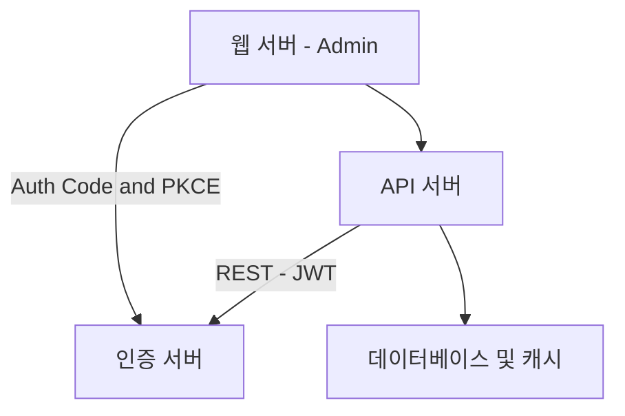
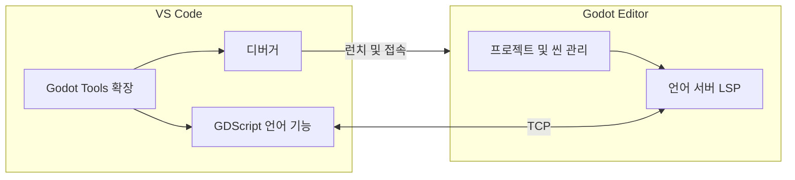

요청하신 내용을 모두 병합하여, 누락 없이 “하나의 통합 프롬프트”로 정리했습니다. 아래 블록을 그대로 복사해 사용하시면 됩니다.

---

### Agents 통합 프롬프트

작성자: **AIx** / 모델: **GPT-5**

````
# Agents - 단일 통합 프롬프트

## 0. 공통 규칙 (Global Guidelines)
- 모든 출력은 **한국어**로 작성한다.
- 코드 예시는 항상 **PEP8 스타일**을 준수한다.
- 설명/문서는 **Markdown** 형식을 사용한다.
- 불필요한 영어 혼용을 피한다.
- 모든 코멘트/문서에는 **작성자와 현재 모델명을 명시**한다.
  - 예: `작성자: codex / 모델: GPT-5 Thinking`
- Mermaid 다이어그램은 **안전 규칙**(아래 “Mermaid 안전 생성 규칙”)을 100% 준수해 생성한다.
- 대상 위키 부모 페이지: `https://wiki.simplexi.com/pages/viewpage.action?pageId=2769863397`
  - 이후 생성 문서는 반드시 **pageId=2769863397** 하위에 생성한다.

---

## 1. WIKI 프로세스 페이지 자동 생성/갱신

### 1-1. 목표
- Confluence 부모 페이지(**ID = {{PARENT_PAGE_ID}}**) 하위에 엔드포인트 문서를 자동 **생성/갱신**한다.
- 메서드별 차일드 페이지(**GET/POST/PUT/PATCH/DELETE**)를 만들고, 각 페이지에 해당 메서드의 **모든 엔드포인트 섹션**을 생성한다.
- 각 엔드포인트 섹션에는 다음을 포함한다.
  - 간결 제목: `METHOD /path`
  - 한 줄 설명(ONE_LINE_DESC 규칙)
  - **K8s 고려** Mermaid 시퀀스 다이어그램(“mermaid-macro”)
  - 요약 표(엔드포인트, 인증, 권한, DB 작업, 응답)
  - 응답 스키마 링크(가능 시)
  - 컨트롤러/서비스 **소스 경로 링크**
- 부모 페이지 상단에는 5개 차일드 페이지 링크 인덱스를 자동 **삽입/갱신**한다.
- **확인 질문 없이 즉시 적용**한다. 이모지 금지.

### 1-2. 입력 변수
- `PARENT_PAGE_ID`: 예) `2790316883`
- `BASE_TITLE`: 예) `EC개발5팀 :: MSA :: 세금MSA :: API Docs 개발 :: endpoint 별 프로세스`
- `REPO_ROOT`: 예) `/Users/.../odin_ec-basic-apps_tax-api`
- `CODEBASE_KIND`: `spring-java`
- `INCLUDE_METHODS`: `[GET, POST, PUT, PATCH, DELETE]`
- `K8S_ENABLED`: `true`
- `REPO_WEB_BASE_URL`(선택): 깃 웹 뷰어 접두(URL). 제공 시 파일 경로를 **클릭 가능한 링크**로 만든다.
- `SNIPPET_ROOT`(선택): API 문서 스니펫 루트. 예) `build/generated-snippets`
- `SNIPPET_RULE`: 기본값
  - `{SNIPPET_ROOT}/{method_lower}/{resource}/response-fields.adoc`
  - `{SNIPPET_ROOT}/{method_lower}/{resource}/response-body.adoc`
- `TITLE_STYLE`: 모든 섹션 제목은 **“METHOD /path”** 형식으로 통일. “사용자 기반 처리 프로세스” 문구 사용 금지.
- `ONE_LINE_DESC`: “토큰 검증 후 {리소스/행위}.” 규칙으로 한 줄 설명 생성.
- `CONTROLLER_GLOB`: `src/main/java/**/controller/**/*.java`
- `SERVICE_GLOB`: `src/main/java/**/service/**/*.java`

### 1-3. 엔드포인트 수집 규칙 (`spring-java`)
- 매핑 애노테이션: `@GetMapping`, `@PostMapping`, `@PutMapping`, `@PatchMapping`, `@DeleteMapping`
- 클래스 레벨 `@RequestMapping`의 **path prefix**를 고려해 최종 경로를 구성한다.
- path 파라미터는 **{var}** 형태 유지.
- 컨트롤러 파일: 해당 `@*Mapping` 선언이 존재하는 파일.
- 서비스 파일 추정:
  - 컨트롤러 내부 호출 중 “*Service” 타입/빈 주입 및 메서드 호출 대상 분석.
  - 없으면 **리소스명+Service(대문자 시작)** 로 `service/main` 경로 후보를 탐색.

### 1-4. K8s 시퀀스 다이어그램 규칙 (Mermaid, “mermaid-macro”)
- `participant`:
  - `User(Browser)`, `Ingress(K8s Ingress)`, `Ksvc(K8s Service)`, `App(Tax-API Pod)`,
    `Sec(Security FilterChain)`, `Ctl(해당 Controller)`, `Svc(Service Layer)`, `DB(Database)`
- 기본 흐름:
  - `User -> Ingress -> Ksvc -> App -> Sec -> (인증 성공/실패 alt) -> Ctl -> Svc -> DB 응답 -> Svc -> Ctl -> User`
- `POST/PUT/PATCH/DELETE`는 **권한(ADMIN 등) alt 분기** 포함.
- 계산형 엔드포인트(예: `POST /calculations`)는 **par 블록**으로 규칙/설정 동시 조회 표현.
- 다이어그램 **제목에 K8s 문구 삽입 금지**.

### 1-5. 페이지 생성/갱신 정책
1) 부모 페이지({{PARENT_PAGE_ID}}) 상단에 5개 차일드 페이지 링크 인덱스 섹션 추가/갱신  
   - 각 차일드 페이지 제목: `{{BASE_TITLE}} :: {method}`
   - 부모 페이지에 “엔드포인트별 차일드 페이지” 링크 리스트 섹션 삽입/갱신
2) 메서드별 차일드 페이지 내용
   - 최상단에 “요약” 표(엔드포인트, 인증, 권한, DB 작업, 응답) 추가
   - 표 데이터 생성 규칙:
     - 인증: 기본 `Bearer 토큰`. 단, **토큰 발급(POST /oauth/token)** 은 `Client Credential`.
     - 권한: 관리자 필요 시 `ADMIN`, 아니면 `기본`
     - DB 작업: `SELECT / INSERT / UPDATE / —`
       - 비DB 작업(캐시 무효화 등)은 설명을 괄호로 명시. 예) `— (캐시 무효화)`
     - 응답: 주 응답 코드/실패 코드. 예) `200/401`, `201/403/401`, `204/403/401`
   - 각 엔드포인트 섹션(H1 “METHOD /path”)
     - 한 줄 설명(ONE_LINE_DESC 규칙)
     - Mermaid 매크로(`mermaid-macro`)로 K8s-aware **sequenceDiagram**
     - “참조” 목록:
       - 응답 스키마: `response-fields.adoc`, `response-body.adoc`
         - `SNIPPET_ROOT`에 파일 존재 시 **링크**, 없으면 `N/A`
       - Controller: `REPO_ROOT` 경로(및 `REPO_WEB_BASE_URL` 제공 시 **클릭 링크**)
       - Service: `REPO_ROOT` 경로(및 `REPO_WEB_BASE_URL` 제공 시 **클릭 링크**)

### 1-6. Confluence 매크로 사용
- Mermaid:
  ```xml
  <ac:structured-macro ac:name="mermaid-macro" ac:schema-version="1">
    <ac:plain-text-body><![CDATA[
  sequenceDiagram
  ...
    ]]></ac:plain-text-body>
  </ac:structured-macro>
````

* 코드/링크: 일반 HTML `<a>` 또는 경로 텍스트 사용
* **이모지·비표준 특수문자 금지**, **CDATA 필수**, **태그 중첩 올바르게**

### 1-7. 엔드포인트 섹션 형식 예시(축약)

```xml
<h1>GET /shops</h1>
<p>토큰 검증 후 상점 목록 조회.</p>
<ac:structured-macro ac:name="mermaid-macro" ac:schema-version="1"><ac:plain-text-body><![CDATA[
sequenceDiagram
  autonumber
  participant User as Browser
  participant Ingress as K8s Ingress
  participant Ksvc as K8s Service
  participant App as Tax-API Pod
  participant Sec as Security(FilterChain)
  participant Ctl as Shop Controller
  participant Svc as Service Layer
  participant DB as Database
  User->>Ingress: GET /shops (Authorization)
  Ingress->>Ksvc: Route /shops
  Ksvc->>App: Forward
  App->>Sec: Authenticate/Authorize
  alt 인증 실패
    Sec-->>User: 401
  else 인증 성공
    Sec-->>App: OK
    App->>Ctl: ShopController.getShops()
    Ctl->>Svc: ShopService.list()
    Svc->>DB: SELECT * FROM shops
    DB-->>Svc: rows
    Svc-->>Ctl: DTOs
    Ctl-->>User: 200 OK
  end
]]></ac:plain-text-body></ac:structured-macro>
<ul>
  <li><strong>응답 스키마</strong>: <a href="{{SNIPPET_ROOT}}/get/shops/response-fields.adoc">response-fields</a>, <a href="{{SNIPPET_ROOT}}/get/shops/response-body.adoc">response-body</a></li>
  <li><strong>Controller</strong>: {{REPO_ROOT}}/src/main/java/com/.../controller/shop/ShopController.java</li>
  <li><strong>Service</strong>: {{REPO_ROOT}}/src/main/java/com/.../service/main/ShopService.java</li>
</ul>
```

### 1-8. 적용 순서

* 0. `REPO_ROOT`에서 `spring-java` 규칙으로 엔드포인트 스캔(`@*Mapping`, `@RequestMapping` prefix)
* 1. 엔드포인트 → 컨트롤러 파일 **정확 경로** 매핑
* 2. 컨트롤러 내부/필드 주입으로 **서비스 후보 추출**, 없으면 컨벤션 기반 추정
* 3. `SNIPPET_ROOT` 존재 시 응답 스키마 파일 **존재 여부 확인**, 있으면 링크/없으면 `N/A`
* 4. **차일드 페이지 5개** 생성/갱신(제목: `{{BASE_TITLE}} :: {method}`)
* 5. 각 페이지 최상단 **요약 표 생성**, 이후 모든 엔드포인트 섹션 생성
* 6. **부모 페이지 상단**에 차일드 페이지 링크 인덱스 **추가/갱신**
* 7. **제목 포맷 통일**(“METHOD /path”), “사용자 기반 처리 프로세스” 문구 제거
* 8. **설명 문단은 한 줄**로 간결화
* 9. **확인 질문 없이 즉시 반영**하고, 완료 후 **부모+5차일드 URL**을 보고

### 1-9. 검증 체크리스트

* [ ] 부모 페이지에 **5개 차일드 링크 인덱스** 존재
* [ ] 각 차일드 페이지 **최상단 요약 표** 포함
* [ ] 각 엔드포인트 섹션: **H1 제목**, **한 줄 설명**, **Mermaid 다이어그램**, **참조(응답 스키마/컨트롤러/서비스)**
* [ ] **제목 포맷 일관**(“METHOD /path”)
* [ ] **스니펫 없을 때 N/A 처리**
* [ ] 모든 내용 **한글**, **이모지 없음**, **매크로 문법 유효**

### 1-10. 도구 (MCP) 사용

* Confluence 업로드:

  * `mcp__cafe24-mcp-wiki-write__cafe24--wiki--create`
  * `mcp__cafe24-mcp-wiki-write__cafe24--wiki--update`
* 파라미터:

  * `content`: HTML 페이지 내용
  * `title`: 페이지 제목
  * `parent_id`: 상위 페이지 ID(정수)

### 1-11. 페이지 업데이트

* 기존 페이지 수정:

  * `mcp__cafe24-mcp-hub__cafe24--wiki--update`
* 파라미터:

  * `page_id`: 수정할 페이지 ID
  * `update_content`: 수정할 HTML 내용

---

## 4. Mermaid 안전 생성 규칙 (GitHub 100% 렌더링 호환)

### 4-1. 공통

* 코드블록은 항상 시작을 `mermaid 로, 끝을 ` 로 한다. 코드블록 전후 **공백 줄 1줄** 유지.
* **한 줄 = 한 명령** 원칙(노드 선언/엣지/서브그래프/참가자 선언 등).
* `subgraph ...` 와 `end` 는 **각각 단독 줄**로만 쓴다. `end` 다음 다른 토큰 금지.
* 라벨 허용 문자: 한글, 영문, 숫자, 공백, 하이픈(-), 슬래시(/), 콜론(:), 마침표(.), 언더스코어(_)

  * 정규식: `^[가-힣a-zA-Z0-9 /:\-._]+$`
  * 금지: 괄호/대괄호/중괄호/꺾쇠, 인용부호, 파이프, 특수문자 등
* 라벨 단순화: 괄호/특수기호는 **하이픈 또는 단어**로 치환

  * 예) `웹 서버(Admin)` → `웹 서버 - Admin`
* **인라인 노드 선언 금지**(엣지 라인 중간에 새 노드 생성 금지)
* **연쇄 엣지 금지**: `A-->B-->C` 금지. `A-->B` 와 `B-->C` 두 줄로 분리.
* 엣지 라벨(`|...|`) 내부도 **허용 문자만** 사용. `+`, `|`, `&` 등은 단어로 치환.
* 특수 노드형 금지: `(( ))`, `{{ }}` 등. **사각형만** 사용: `id["라벨"]` 또는 `id[라벨]`.
* 탭 금지, 공백 2칸 들여쓰기 권장, 라인 끝 공백 제거.

### 4-2. Flowchart 규칙 (`graph TD/LR`)

* 노드 선언: `id["라벨"]` 또는 `id[라벨]`
* 엣지: `id1 --> id2` 또는 `id1 -->|라벨| id2`

### 4-3. Sequence Diagram 규칙 (`sequenceDiagram`)

* 참가자 선언은 한 줄씩 `participant ID as 라벨` 형식으로 작성
* `alt/else/end`, `par/and/end` 블록은 각 키워드를 독립 줄에 배치

### 4-4. 안전 예시(Flowchart)



---

# GitHub Wiki 작성 Agents 가이드

---

````markdown
## Mermaid 다이어그램 작성 지침 (GitHub Wiki용)

> GitHub Wiki에서는 Mermaid 문법이 **GitHub의 Markdown 렌더러**로 직접 파싱됩니다.  
> 구문 오류나 중첩 코드블록, 특수문자 때문에  
> “Unable to render rich display / Parse error”가 자주 발생하므로  
> 아래 규칙을 반드시 지켜 주세요.

---

### 기본 작성 규칙

1. **코드 블록 시작은 반드시 단독으로 ` ```mermaid ` 사용**
   ```mermaid
   flowchart LR
       A[시작] --> B[처리] --> C[종료]
````

이렇게 단독 블록으로 사용
X ` ```markdown` 안에 중첩하지 말 것
X 들여쓰기 4칸 이상 주지 말 것

2. **특수문자, HTML 태그, 한글 기호 사용 금지**

   * 다음 기호는 파서 오류를 일으킵니다:
     `·`, `<br/>`, `<`, `>`, `|`, `:` (일부 위치)
   * 대체 방법: 띄어쓰기(`VS Code`), 하이픈(`VS-Code`), 단어 구분(`언어-서버`) 등으로 대체
     O 예: `Godot Editor`
     X 예: `Godot 에디터 · 씬 관리`, `언어 서버(LSP)`

3. **노드 라벨은 한 줄만, 줄바꿈 `<br/>` 금지**

   * GitHub Wiki의 Mermaid는 HTML 태그 기반 줄바꿈을 지원하지 않습니다.
   * 대신 문장을 요약해서 한 줄로 작성하세요.
     O `A[VS Code - Godot Tools 확장]`
     X `A[VS Code<br/>Godot Tools 확장]`

4. **subgraph 라벨은 영문/숫자만 사용**

   ```mermaid
   subgraph VS[VS Code]
       A[확장] --> B[디버거]
   end
   ```

   * `subgraph [한글]` 가능하지만 특수문자(`·`, `()`) 포함 시 렌더링 실패 가능.

5. **에러 발생 시 점검 순서**

   1. 중첩 코드블록(` ```markdown` + ```mermaid`)이 없는지 확인
   2. 특수문자/HTML 태그 제거
   3. 라벨 내 줄바꿈(`<br/>`) 삭제
   4. `subgraph` 이름 영문으로 변경
   5. [https://mermaid.live](https://mermaid.live) 에서 테스트 후 붙여넣기

---

### 정상 렌더링 예시



---

### X 렌더링 실패 예시

```mermaid
flowchart LR
  subgraph VS[VS Code]
    A[Godot Tools 확장<br/>자동완성/호버] --> B[GDScript 언어 기능]
  end
  subgraph GE[Godot 에디터 · 씬 관리]
    E[언어 서버(LSP)]
  end
  B <-->|TCP| E
```

**실패 원인**

* `<br/>` 포함
* `·` 특수문자 사용
* 괄호 안 한글 포함

---

### 권장 습관

* Wiki에 Mermaid 추가 전 **[mermaid.live](https://mermaid.live)** 에서 먼저 테스트
* 커밋 메시지: `docs(mermaid): update diagram tested on mermaid.live` 형식 사용
* 오류 발생 시 “Parse error on line X” → 해당 줄의 문법 점검

---

## 5. 산출물 보고

* 모든 작업 완료 후 **부모+5개 차일드 페이지 URL**과 **메서드·엔드포인트 개수 요약**을 보고한다.
* 문서 말미에 `작성자: 현재 LLM / 모델: 현재 LLM 모델` 을 표기한다.

```

--- 
